# 🚀 Daily Tech News Email Workflow

> **Automated GitHub Actions workflow that delivers the latest technology news directly to your inbox every day.**

[](https://github.com/features/actions)
[](https://www.python.org/)
[](https://newsapi.org/)
[](LICENSE)

---

## 📖 Overview

**Daily Tech News Email Workflow** is a fully automated solution that keeps you updated with the latest technology news without lifting a finger. Using GitHub Actions, this workflow runs daily, fetches top technology headlines from NewsAPI.org, and delivers them to your email as a beautifully formatted HTML newsletter.

Perfect for developers, tech enthusiasts, and anyone who wants to stay informed about the latest tech trends without manually checking news sites.

---

## ✨ Features

- 📰 **Automated Daily Updates** - Runs automatically every day at 8:00 AM UTC (1:30 PM IST)
- 📧 **Beautiful HTML Emails** - Professional, responsive email design with modern styling
- 🎨 **Rich Formatting** - Includes article titles, descriptions, sources, and publication dates
- 🔗 **Clickable Links** - Direct links to full articles for easy reading
- 🔒 **Secure** - Uses GitHub Secrets for credential management
- 🆓 **Free** - Uses free tier APIs (NewsAPI.org)
- ⚡ **Fast** - Delivers news within seconds of scheduled run
- 🛠️ **Customizable** - Easy to modify schedule, news categories, and email design
- 📱 **Multi-Provider Support** - Works with Gmail, Outlook, Yahoo, and other SMTP providers
- 🎯 **Manual Trigger** - Run on-demand anytime via GitHub Actions

---

## 🎯 How It Works

```mermaid
graph LR
    A[GitHub Actions<br/>Scheduled Trigger] --> B[Fetch News<br/>from NewsAPI]
    B --> C[Format HTML<br/>Email Template]
    C --> D[Send via<br/>SMTP]
    D --> E[📧 Email Inbox]
    
    style A fill:#2563eb
    style E fill:#16a34a
```



1. **GitHub Actions** triggers the workflow daily at a scheduled time
2. **Python script** fetches the latest technology headlines from NewsAPI.org
3. **HTML template** formats the news into a beautiful email newsletter
4. **SMTP client** sends the email to your configured recipient address
5. **You receive** the latest tech news in your inbox!

---

## 🚀 Quick Start

### Prerequisites

- GitHub account
- Email account (Gmail, Outlook, or Yahoo)
- NewsAPI.org account (free tier)

### Installation

1. **Fork or clone this repository**
   ```bash
   git clone https://github.com/Tharinda-Pamindu/news_updater.git
   cd news_updater
   ```

2. **Get your NewsAPI key**
   - Sign up at [newsapi.org/register](https://newsapi.org/register)
   - Copy your API key

3. **Set up GitHub Secrets**
   
   Go to your repository → Settings → Secrets and variables → Actions → New repository secret
   
   Add these 4 secrets:
   
   | Secret Name | Description | Example |
   |-------------|-------------|---------|
   | `NEWS_API_KEY` | Your NewsAPI.org API key | `abc123def456...` |
   | `EMAIL_USERNAME` | Your SMTP email address | `you@gmail.com` |
   | `EMAIL_PASSWORD` | Email app password | `abcd efgh ijkl mnop` |
   | `RECIPIENT_EMAIL` | Where to receive news | `you@gmail.com` |

4. **Enable GitHub Actions**
   - Go to Actions tab in your repository
   - Enable workflows if prompted

5. **Test the workflow**
   - Go to Actions → Daily Tech News Email
   - Click "Run workflow" → "Run workflow"
   - Check your email inbox!

---

## 📧 Email Preview

The newsletter includes:

- **📰 Top 10 Technology Headlines** - Latest and most relevant tech news
- **🔗 Direct Article Links** - Click to read full articles
- **📅 Publication Dates** - Know when news was published
- **🏢 Source Attribution** - See which publication reported the news
- **🎨 Modern Design** - Clean, professional layout with brand colors

---

## ⚙️ Configuration

### Change Schedule

Edit `.github/workflows/daily-tech-news.yml` line 6:

```yaml
schedule:
  - cron: '0 8 * * *'  # 8:00 AM UTC daily
```

**Popular schedules:**
- `'0 0 * * *'` - Midnight UTC (5:30 AM IST)
- `'0 12 * * *'` - Noon UTC (5:30 PM IST)
- `'0 8 * * 1-5'` - 8 AM UTC, weekdays only
- `'0 0 * * 1'` - Monday mornings only

Use [crontab.guru](https://crontab.guru/) to create custom schedules.

### Change News Category

Edit `fetch_news.py` line 24:

```python
params = {
    "category": "technology",  # Options: business, science, health, entertainment, sports
    "language": "en",
    "pageSize": 10,
    "apiKey": api_key
}
```

### Change Number of Articles

Modify `pageSize` (max 100 for free tier):

```python
"pageSize": 15,  # Get 15 articles instead of 10
```

---

## 🔧 Local Testing

Test the workflow locally before deploying:

1. **Create `.env` file**
   ```bash
   cp .env.example .env
   ```

2. **Add your credentials to `.env`**
   ```env
   NEWS_API_KEY=your_newsapi_key
   EMAIL_USERNAME=your_email@gmail.com
   EMAIL_PASSWORD=your_app_password
   RECIPIENT_EMAIL=your_email@gmail.com
   ```

3. **Install dependencies**
   ```bash
   pip install -r requirements.txt
   ```

4. **Run the script**
   ```bash
   python fetch_news.py
   ```

5. **Check your email!**

---

## 🔐 Gmail App Password Setup

If using Gmail, you **must** use an App Password:

1. Enable 2-Factor Authentication on your Google account
2. Go to [myaccount.google.com/apppasswords](https://myaccount.google.com/apppasswords)
3. Select **Mail** and **Other (Custom name)**
4. Enter "GitHub Actions" as the name
5. Click **Generate**
6. Copy the 16-character password (remove spaces)
7. Use this as your `EMAIL_PASSWORD` secret

---

## 📁 Project Structure

```
news_updater/
├── .github/
│   └── workflows/
│       └── daily-tech-news.yml    # GitHub Actions workflow
├── fetch_news.py                   # Main Python script
├── requirements.txt                # Python dependencies
├── .env.example                    # Environment variables template
├── .gitignore                      # Git ignore rules
└── README.md                       # This file
```

---

## 🛠️ Technologies Used

- **GitHub Actions** - Workflow automation and scheduling
- **Python 3.11+** - Script execution
- **NewsAPI.org** - News aggregation API
- **SMTP** - Email delivery protocol
- **HTML/CSS** - Email template design

---

## 📊 API Usage

**NewsAPI.org Free Tier:**
- ✅ 100 requests per day
- ✅ Top headlines access
- ✅ Multiple categories
- ✅ 30 days of historical data

**Email Sending:**
- ✅ Unlimited emails via SMTP
- ✅ No API limits
- ✅ Works with any SMTP provider

---

## 🐛 Troubleshooting

### Workflow Not Running

- ✓ Check GitHub Actions is enabled in repository settings
- ✓ Verify workflow file is in `.github/workflows/` directory
- ✓ Check Actions tab for error messages

### Email Not Received

- ✓ Verify all 4 GitHub secrets are set correctly
- ✓ Check spam/junk folder
- ✓ For Gmail: Ensure you're using App Password, not regular password
- ✓ Review workflow logs for SMTP errors

### API Errors

- ✓ Verify NewsAPI key is valid at [newsapi.org/account](https://newsapi.org/account)
- ✓ Check you haven't exceeded 100 requests/day limit
- ✓ Ensure `NEWS_API_KEY` secret is set correctly

### SMTP Authentication Failed

- ✓ **Gmail**: Must use App Password with 2FA enabled
- ✓ **Outlook**: Check "Less secure app access" settings
- ✓ **Yahoo**: Use app-specific password
- ✓ Verify `EMAIL_USERNAME` and `EMAIL_PASSWORD` are correct

---

## 🎨 Customization Ideas

- **Multiple Recipients** - Modify script to send to multiple emails
- **Different Time Zones** - Adjust cron schedule for your timezone
- **Custom Categories** - Mix business, science, and tech news
- **Weekly Digest** - Change schedule to run once per week
- **Custom Styling** - Modify HTML template colors and layout
- **Add Images** - Include article images in email (requires API upgrade)

---

## 🤝 Contributing

Contributions are welcome! Here's how you can help:

1. Fork the repository
2. Create a feature branch (`git checkout -b feature/AmazingFeature`)
3. Commit your changes (`git commit -m 'Add some AmazingFeature'`)
4. Push to the branch (`git push origin feature/AmazingFeature`)
5. Open a Pull Request

---

## 📝 License

This project is licensed under the MIT License - see the [LICENSE](LICENSE) file for details.

---

## 🙏 Acknowledgments

- [NewsAPI.org](https://newsapi.org/) - For providing free news aggregation API
- [GitHub Actions](https://github.com/features/actions) - For free workflow automation
- [Python](https://www.python.org/) - For the amazing programming language

---

## 📞 Support

If you encounter any issues or have questions:

1. Check the [Troubleshooting](#-troubleshooting) section
2. Review [GitHub Actions logs](https://github.com/Tharinda-Pamindu/news_updater/actions)
3. Open an [issue](https://github.com/Tharinda-Pamindu/news_updater/issues)

---

## 🌟 Show Your Support

If you find this project useful, please consider:

- ⭐ Starring the repository
- 🍴 Forking for your own use
- 📢 Sharing with others
- 🐛 Reporting bugs
- 💡 Suggesting new features

---

<div align="center">

**Made with ❤️ by [Tharinda Pamindu](https://github.com/Tharinda-Pamindu)**

*Stay informed. Stay ahead.*

</div>

## ✨ Features

- 📰 Fetches top 10 technology headlines from NewsAPI.org
- 📧 Sends formatted HTML email newsletter
- ⏰ Runs automatically every day at 8:00 AM UTC
- 🎨 Beautiful, responsive email design
- 🔧 Easy to customize and configure
- 🆓 Uses free tier APIs

## 🛠️ Setup Instructions

### 1. Get a NewsAPI Key

1. Visit [NewsAPI.org](https://newsapi.org/register)
2. Sign up for a free account
3. Copy your API key (free tier includes 100 requests/day)

### 2. Configure GitHub Secrets

Add the following secrets to your GitHub repository:

1. Go to your repository on GitHub
2. Click **Settings** → **Secrets and variables** → **Actions**
3. Click **New repository secret** and add each of the following:

| Secret Name | Description | Example |
|-------------|-------------|---------|
| `NEWS_API_KEY` | Your NewsAPI.org API key | `abc123def456...` |
| `EMAIL_USERNAME` | Your SMTP email address | `yourname@gmail.com` |
| `EMAIL_PASSWORD` | Your email app password | `abcd efgh ijkl mnop` |
| `RECIPIENT_EMAIL` | Email where you want to receive news | `yourname@gmail.com` |

### 3. Email Provider Setup

#### For Gmail Users (Recommended)

> [!IMPORTANT]
> Gmail requires an **App Password** instead of your regular password.

1. Enable 2-Factor Authentication on your Google account
2. Go to [Google App Passwords](https://myaccount.google.com/apppasswords)
3. Select **Mail** and **Other (Custom name)**
4. Enter "GitHub Actions" as the name
5. Click **Generate**
6. Copy the 16-character password (remove spaces)
7. Use this as your `EMAIL_PASSWORD` secret

#### For Outlook/Hotmail Users

1. Use your regular Outlook email and password
2. Make sure "Less secure app access" is enabled if required

#### For Yahoo Users

1. Generate an app password from [Yahoo Account Security](https://login.yahoo.com/account/security)
2. Use the app password as your `EMAIL_PASSWORD`

### 4. Customize Schedule (Optional)

The workflow runs daily at **8:00 AM UTC** by default. To change this:

1. Open [`.github/workflows/daily-tech-news.yml`](.github/workflows/daily-tech-news.yml)
2. Modify the cron expression:

```yaml
schedule:
  - cron: '0 8 * * *'  # Format: minute hour day month day-of-week
```

**Examples:**
- `'0 12 * * *'` - Noon UTC (12:00 PM)
- `'30 6 * * *'` - 6:30 AM UTC
- `'0 0 * * 1'` - Midnight UTC every Monday

> [!TIP]
> Use [crontab.guru](https://crontab.guru/) to help create cron expressions.

### 5. Test the Workflow

#### Manual Trigger

1. Go to your repository on GitHub
2. Click **Actions** tab
3. Select **Daily Tech News Email** workflow
4. Click **Run workflow** → **Run workflow**
5. Wait for the workflow to complete
6. Check your email inbox

#### View Logs

1. Click on the workflow run
2. Click on the **send-tech-news** job
3. Expand each step to see detailed logs

## 🧪 Local Testing

To test the script locally before deploying:

1. Clone the repository:
```bash
git clone <your-repo-url>
cd news_updates
```

2. Create a `.env` file from the example:
```bash
cp .env.example .env
```

3. Edit `.env` and add your credentials:
```bash
NEWS_API_KEY=your_actual_api_key
EMAIL_USERNAME=your_email@gmail.com
EMAIL_PASSWORD=your_app_password
RECIPIENT_EMAIL=your_email@gmail.com
```

4. Install dependencies:
```bash
pip install -r requirements.txt
```

5. Run the script:
```bash
python fetch_news.py
```

## 📧 Email Preview

The email newsletter includes:
- 📰 Top 10 technology headlines
- 🔗 Clickable article links
- 📅 Publication dates and times
- 🏢 News source attribution
- 🎨 Clean, modern design

## 🔧 Troubleshooting

### Workflow Not Running

- Check that the workflow file is in `.github/workflows/` directory
- Verify GitHub Actions is enabled in repository settings
- Check the Actions tab for any error messages

### Email Not Received

- Verify all GitHub secrets are set correctly
- Check spam/junk folder
- Review workflow logs for error messages
- For Gmail: Ensure you're using an App Password, not your regular password
- Test with manual workflow trigger first

### API Errors

- Verify your NewsAPI key is valid
- Check you haven't exceeded the free tier limit (100 requests/day)
- Ensure the API key is correctly set in GitHub secrets

### SMTP Authentication Failed

- **Gmail**: Must use App Password with 2FA enabled
- **Outlook**: Check if "Less secure app access" needs to be enabled
- **Yahoo**: Use app-specific password
- Verify `EMAIL_USERNAME` and `EMAIL_PASSWORD` are correct

## 🎨 Customization

### Change News Category

Edit `fetch_news.py` and modify the API parameters:

```python
params = {
    "category": "technology",  # Change to: business, science, health, etc.
    "language": "en",
    "pageSize": 10,
    "apiKey": api_key
}
```

### Change Number of Articles

Modify `pageSize` in the API parameters (max: 100 for free tier):

```python
"pageSize": 15,  # Get 15 articles instead of 10
```

### Customize Email Design

Edit the HTML template in the `create_html_email()` function in `fetch_news.py`.

## 📝 License

This project is open source and available under the MIT License.

## 🤝 Contributing

Contributions, issues, and feature requests are welcome!

## 📬 Support

If you encounter any issues, please check the troubleshooting section or open an issue on GitHub.

---

**Powered by:**
- [NewsAPI.org](https://newsapi.org/) - News aggregation
- [GitHub Actions](https://github.com/features/actions) - Automation
- Python 3.11+ - Script execution
